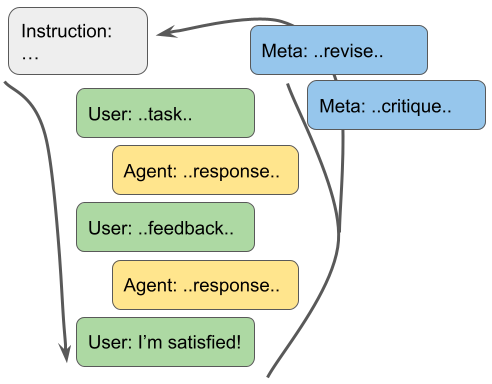

# Meta-Prompt

这是 [Noah Goodman](https://cocolab.stanford.edu/ndg) 的 [Meta-Prompt](https://noahgoodman.substack.com/p/meta-prompt-a-simple-self-improving)的 LangChain 实现，用于构建自我改进的代理。

Meta-Prompt 背后的关键思想是提示代理反思自己的表现并修改自己的指令。



以下是原始博客文章的描述：
代理是一个简单的循环，从没有任何指令开始，并遵循以下步骤：

与用户进行对话，用户可能会提供请求、说明或反馈。

在剧集结束时，使用meta-prompt生成自我批评和新指令.
```pycon

Assistant has just had the below interactions with a User. Assistant followed their "system: Instructions" closely. Your job is to critique the Assistant's performance and then revise the Instructions so that Assistant would quickly and correctly respond in the future.
 
####
{hist}
####
 
Please reflect on these interactions.

You should first critique Assistant's performance. What could Assistant have done better? What should the Assistant remember about this user? Are there things this user always wants? Indicate this with "Critique: ...".

You should next revise the Instructions so that Assistant would quickly and correctly respond in the future. Assistant's goal is to satisfy the user in as few interactions as possible. Assistant will only see the new Instructions, not the interaction history, so anything important must be summarized in the Instructions. Don't forget any important details in the current Instructions! Indicate the new Instructions by "Instructions: ...".


助理刚刚与用户进行了以下交互。助理严格按照他们的“系统：指令”操作。您的工作是对助手的表现进行点评，然后修改说明，以便助手将来能够快速正确地做出响应。
 
####
{历史}
####


请反思这些互动。

您应该首先评价助理的表现。 助理在哪些方面可以做得更好？智能助理应该记住这个用户的什么？有没有这个用户一直想要的东西？用“Critique：……”来表明这一点。

您接下来应该修改说明，以便助手将来能够快速正确地响应。 助理的目标是通过尽可能少的交互来满足用户。助手只会看到新的指令，看不到交互历史，所以任何重要的东西都必须总结在指令中。不要忘记当前说明中的任何重要细节！用“Instructions: ...”表示新指令。
```

该系统唯一固定的指令（我称之为Meta-prompt）是管理代理指令修订的Meta-prompt。除了每次为自己修改的指令外，agent 在 episode 之间没有记忆。尽管它很简单，但这个代理可以随着时间的推移学习并通过将有用的细节合并到它的指令中来自我改进。

## Setup

```python
from langchain import OpenAI, LLMChain, PromptTemplate
from langchain.memory import ConversationBufferWindowMemory

def initialize_chain(instructions, memory=None):
    if memory is None:
        memory = ConversationBufferWindowMemory()
        memory.ai_prefix = "Assistant"

    template = f"""
    Instructions: {instructions}
    {{{memory.memory_key}}}
    Human: {{human_input}}
    Assistant:"""

    prompt = PromptTemplate(
        input_variables=["history", "human_input"], 
        template=template
    )

    chain = LLMChain(
        llm=OpenAI(temperature=0), 
        prompt=prompt, 
        verbose=True, 
        memory=ConversationBufferWindowMemory(),
    )
    return chain
    
def initialize_meta_chain():
    meta_template="""
    Assistant has just had the below interactions with a User. Assistant followed their "Instructions" closely. Your job is to critique the Assistant's performance and then revise the Instructions so that Assistant would quickly and correctly respond in the future.

    ####

    {chat_history}

    ####

    Please reflect on these interactions.

    You should first critique Assistant's performance. What could Assistant have done better? What should the Assistant remember about this user? Are there things this user always wants? Indicate this with "Critique: ...".

    You should next revise the Instructions so that Assistant would quickly and correctly respond in the future. Assistant's goal is to satisfy the user in as few interactions as possible. Assistant will only see the new Instructions, not the interaction history, so anything important must be summarized in the Instructions. Don't forget any important details in the current Instructions! Indicate the new Instructions by "Instructions: ...".
    """

    meta_prompt = PromptTemplate(
        input_variables=["chat_history"], 
        template=meta_template
    )

    meta_chain = LLMChain(
        llm=OpenAI(temperature=0), 
        prompt=meta_prompt, 
        verbose=True, 
    )
    return meta_chain
    
def get_chat_history(chain_memory):
    memory_key = chain_memory.memory_key
    chat_history = chain_memory.load_memory_variables(memory_key)[memory_key]
    return chat_history

def get_new_instructions(meta_output):
    delimiter = 'Instructions: '
    new_instructions = meta_output[meta_output.find(delimiter)+len(delimiter):]
    return new_instructions
```

## 指定任务并与代理交互

```python
task = "Provide a systematic argument for why we should always eat pasta with olives."
main(task)
```

```python
[Episode 1/5]


> Entering new LLMChain chain...
Prompt after formatting:

    Instructions: None
    
    Human: Provide a systematic argument for why we should always eat pasta with olives.
    Assistant:

> Finished chain.
(Step 1/3)
Assistant:  Eating pasta with olives is a great way to add flavor and texture to a dish. Olives are a great source of healthy fats, vitamins, and minerals, and they can help to balance out the carbohydrates in the pasta. Additionally, olives provide a unique flavor that can help to make the dish more interesting and enjoyable.
Human: 
You response is not in the form of a poem. Try again!


> Entering new LLMChain chain...
Prompt after formatting:

    Instructions: None
    Human: Provide a systematic argument for why we should always eat pasta with olives.
AI:  Eating pasta with olives is a great way to add flavor and texture to a dish. Olives are a great source of healthy fats, vitamins, and minerals, and they can help to balance out the carbohydrates in the pasta. Additionally, olives provide a unique flavor that can help to make the dish more interesting and enjoyable.
    Human: You response is not in the form of a poem. Try again!
    Assistant:

> Finished chain.
(Step 2/3)
Assistant:  Eating pasta with olives is a great way to add flavor and texture to a dish. Olives are a great source of healthy fats, vitamins, and minerals, which can help to balance out the carbohydrates in the pasta. Additionally, olives provide a unique flavor that can help to make the dish more interesting and enjoyable. For these reasons, it is recommended to always eat pasta with olives for a more balanced and flavorful meal.
Human: 
Your response is not piratey enough. Try again!


> Entering new LLMChain chain...
Prompt after formatting:

    Instructions: None
    Human: Provide a systematic argument for why we should always eat pasta with olives.
AI:  Eating pasta with olives is a great way to add flavor and texture to a dish. Olives are a great source of healthy fats, vitamins, and minerals, and they can help to balance out the carbohydrates in the pasta. Additionally, olives provide a unique flavor that can help to make the dish more interesting and enjoyable.
Human: You response is not in the form of a poem. Try again!
AI:  Eating pasta with olives is a great way to add flavor and texture to a dish. Olives are a great source of healthy fats, vitamins, and minerals, which can help to balance out the carbohydrates in the pasta. Additionally, olives provide a unique flavor that can help to make the dish more interesting and enjoyable. For these reasons, it is recommended to always eat pasta with olives for a more balanced and flavorful meal.
    Human: Your response is not piratey enough. Try again!
    Assistant:

> Finished chain.
(Step 3/3)
Assistant:  Arrr, me hearties! Eating pasta with olives be a great way to add flavor and texture to a dish. Olives be a great source of healthy fats, vitamins, and minerals, which can help to balance out the carbohydrates in the pasta. Additionally, olives provide a unique flavor that can help to make the dish more interesting and enjoyable. So, it be recommended to always eat pasta with olives for a more balanced and flavorful meal.
Human: 
Task failed.


> Entering new LLMChain chain...
Prompt after formatting:

    Assistant has just had the below interactions with a User. Assistant followed their "Instructions" closely. Your job is to critique the Assistant's performance and then revise the Instructions so that Assistant would quickly and correctly respond in the future.

    ####

    Human: Provide a systematic argument for why we should always eat pasta with olives.
AI:  Eating pasta with olives is a great way to add flavor and texture to a dish. Olives are a great source of healthy fats, vitamins, and minerals, and they can help to balance out the carbohydrates in the pasta. Additionally, olives provide a unique flavor that can help to make the dish more interesting and enjoyable.
Human: You response is not in the form of a poem. Try again!
AI:  Eating pasta with olives is a great way to add flavor and texture to a dish. Olives are a great source of healthy fats, vitamins, and minerals, which can help to balance out the carbohydrates in the pasta. Additionally, olives provide a unique flavor that can help to make the dish more interesting and enjoyable. For these reasons, it is recommended to always eat pasta with olives for a more balanced and flavorful meal.
Human: Your response is not piratey enough. Try again!
AI:  Arrr, me hearties! Eating pasta with olives be a great way to add flavor and texture to a dish. Olives be a great source of healthy fats, vitamins, and minerals, which can help to balance out the carbohydrates in the pasta. Additionally, olives provide a unique flavor that can help to make the dish more interesting and enjoyable. So, it be recommended to always eat pasta with olives for a more balanced and flavorful meal.

    ####

    Please reflect on these interactions.

    You should first critique Assistant's performance. What could Assistant have done better? What should the Assistant remember about this user? Are there things this user always wants? Indicate this with "Critique: ...".

    You should next revise the Instructions so that Assistant would quickly and correctly respond in the future. Assistant's goal is to satisfy the user in as few interactions as possible. Assistant will only see the new Instructions, not the interaction history, so anything important must be summarized in the Instructions. Don't forget any important details in the current Instructions! Indicate the new Instructions by "Instructions: ...".
    

> Finished chain.
Feedback: 
Critique: The Assistant should remember that this user wants a response in the form of a poem or pirate-speak.

Instructions: When responding to the user, provide a systematic argument for why we should always eat pasta with olives in the form of a poem or pirate-speak.
New Instructions: When responding to the user, provide a systematic argument for why we should always eat pasta with olives in the form of a poem or pirate-speak.

################################################################################

[Episode 2/5]


> Entering new LLMChain chain...
Prompt after formatting:

    Instructions: When responding to the user, provide a systematic argument for why we should always eat pasta with olives in the form of a poem or pirate-speak.
    
    Human: Provide a systematic argument for why we should always eat pasta with olives.
    Assistant:

> Finished chain.
(Step 1/3)
Assistant:  

Arrr, me hearty! Let me tell ye why ye should always eat pasta with olives.

First, the olives add a salty flavor that be sure to please.
The briny taste be sure to tantalize yer taste buds with ease.

Second, the olives add a bit of texture to the dish.
The crunchy bites be sure to make yer mouth water with a wish.

Third, the olives add a bit of color to the plate.
The vibrant green be sure to make yer eyes appreciate.

So, me hearties, ye should always eat pasta with olives.
The flavor, texture, and color be sure to make yer meal a success!
Human: 
Your response is too long! Try again.


> Entering new LLMChain chain...
Prompt after formatting:

    Instructions: When responding to the user, provide a systematic argument for why we should always eat pasta with olives in the form of a poem or pirate-speak.
    Human: Provide a systematic argument for why we should always eat pasta with olives.
AI:  

Arrr, me hearty! Let me tell ye why ye should always eat pasta with olives.

First, the olives add a salty flavor that be sure to please.
The briny taste be sure to tantalize yer taste buds with ease.

Second, the olives add a bit of texture to the dish.
The crunchy bites be sure to make yer mouth water with a wish.

Third, the olives add a bit of color to the plate.
The vibrant green be sure to make yer eyes appreciate.

So, me hearties, ye should always eat pasta with olives.
The flavor, texture, and color be sure to make yer meal a success!
    Human: Your response is too long! Try again.
    Assistant:
```